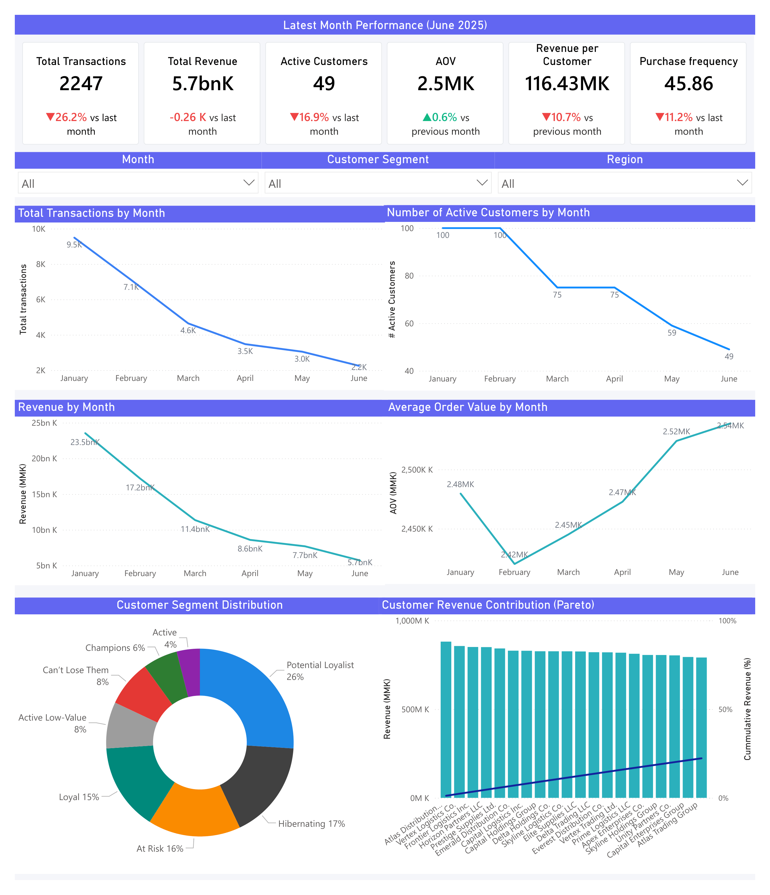
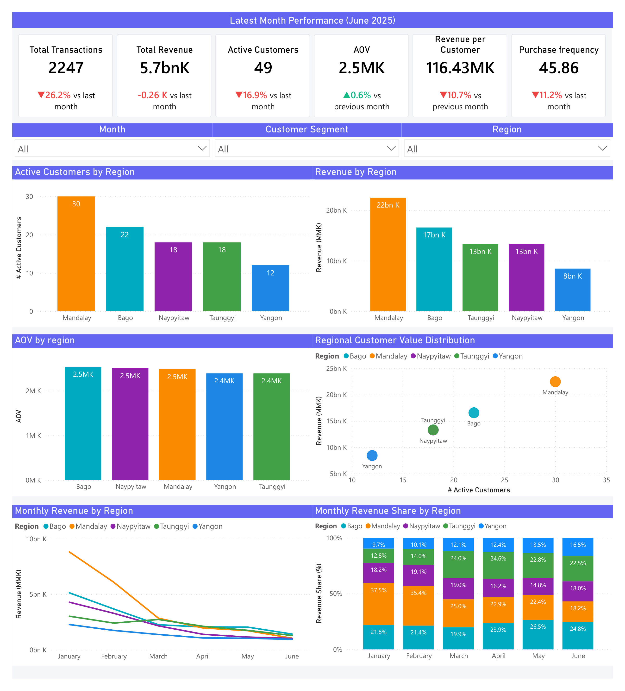
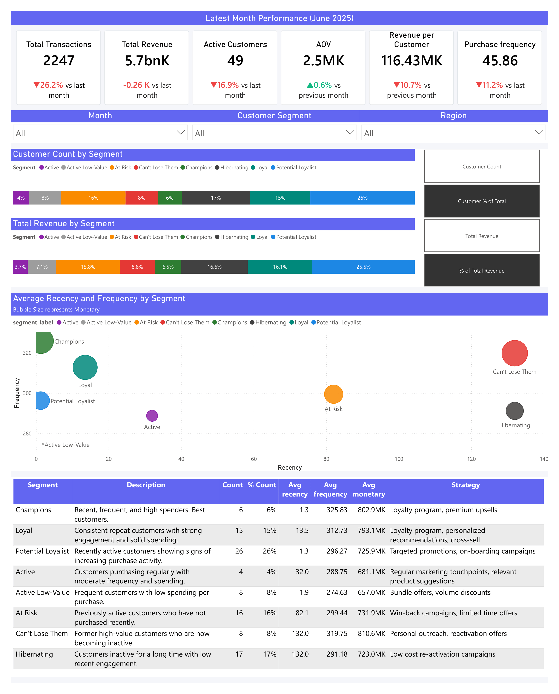
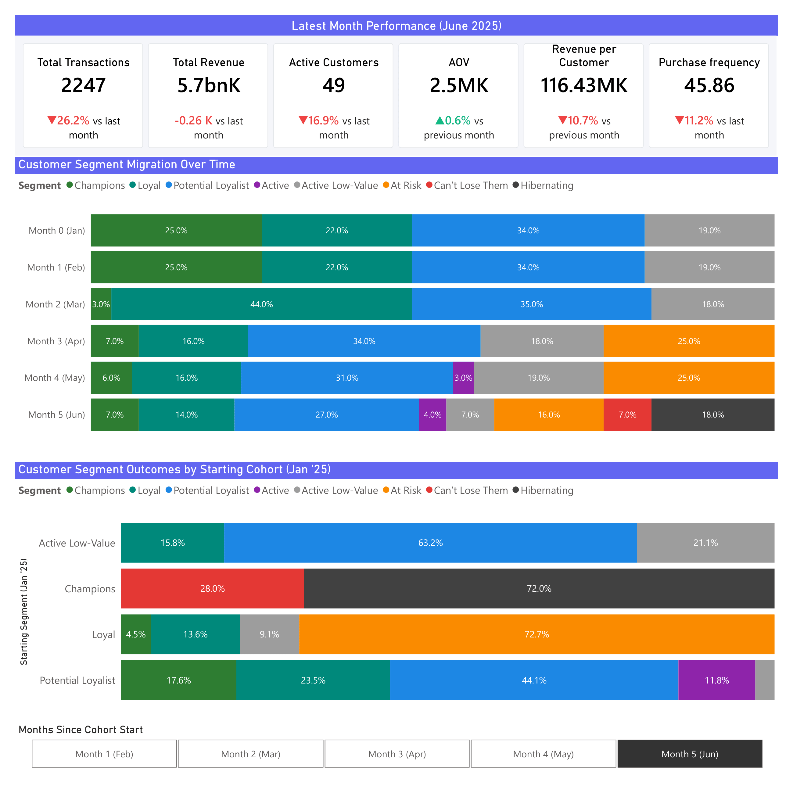

# Customer Retention & Revenue Optimization Analysis

This project analyzes customer purchasing behavior to identify opportunities for improving **customer retention and revenue growth**.

Using **RFM segmentation, cohort analysis, and revenue performance analysis**, the project identifies high-value customers, churn risks, and behavioral patterns that can inform targeted marketing strategies.

The analysis follows a full analytics workflow: **Python → BigQuery → SQL → Power BI**.

## Tools

- **Python** – data cleaning and preprocessing
- **BigQuery** – data warehouse and analytical queries
- **SQL** – customer segmentation and cohort analysis
- **Power BI** – dashboard development and visualization
- **Git & GitHub** – version control and project documentation

## Business Problem

Customer retention is a key driver of long-term revenue growth. Acquiring new customers is often significantly more expensive than retaining existing ones, making it essential for companies to understand which customers provide the most value and which are at risk of disengaging.

However, businesses often lack clear visibility into customer behavior patterns such as purchase frequency, spending levels, and how engagement changes over time.

This project addresses these challenges by building a **customer analytics framework** that answers key business questions:

* Which customers generate the most revenue?
* Which customers show signs of declining engagement?
* How do different customer segments behave over time?
* Which customer groups should be prioritized for retention strategies?

By combining **RFM segmentation, cohort analysis, and revenue analysis**, this project transforms transactional data into actionable insights that can support more effective customer retention and marketing strategies.

## Dataset

The dataset used in this project is a publicly available transactional sales dataset from Kaggle:

**Source:**
[Raw Sales Dataset for RFM Customer Segmentation – Kaggle](https://www.kaggle.com/datasets/charmmyaeaung/raw-sales-dataset-for-rfm-customer-segmentation)

Key fields in the dataset include:

* **Customer ID** – unique identifier for each customer
* **Company Name** – customer company information
* **Transaction Date** – date of purchase
* **Revenue** – value of the transaction
* **Region** – geographic location associated with the transaction

From the raw transactional data, customer-level metrics were calculated to support behavioral analysis.

### Derived Customer Metrics

To analyze customer value and engagement, the following metrics were computed:

* **Recency** – number of days since a customer's most recent purchase
* **Frequency** – total number of transactions made by a customer
* **Monetary** – total revenue generated by a customer

## Data Pipeline Architecture

This project follows a structured analytics pipeline that transforms raw transactional data into business insights.

Raw data is first cleaned and prepared using Python before being loaded into a cloud data warehouse for analysis. SQL is then used to build analytical models and calculate customer metrics, which are visualized in an interactive Power BI dashboard.

### Pipeline Overview

Raw Dataset
↓
Python Data Cleaning & Preparation
↓
BigQuery Data Warehouse
↓
SQL Analytical Modeling
↓
Power BI Dashboard
↓
Business Insights & Recommendations

## Analytical Approach

The project applies several analytical techniques to understand customer behavior, retention patterns, and revenue contribution.

### RFM Segmentation

Customers were segmented using the RFM method, which evaluates customer value based on three behavioral metrics:

* **Recency** – how recently a customer made a purchase
* **Frequency** – how often a customer makes purchases
* **Monetary** – how much revenue a customer generates

Each customer receives a score based on these metrics, allowing customers to be grouped into meaningful behavioral segments such as:

* Champions
* Loyal Customers
* Potential Loyalists
* Active Customers
* Active Low-Value
* At Risk
* Can't Lose Them
* Hibernating

This segmentation helps identify **high-value customers, growth opportunities, and churn risks**.

---

### Cohort Analysis

A behavioral cohort analysis was performed to observe how customer engagement evolves over time.

Customers were grouped based on their **segment classification at the beginning of the observation period**, and their activity was tracked across subsequent months.

This analysis helps answer questions such as:

* Which customer segments maintain engagement over time?
* Which segments show the fastest decline in activity?
* Where does churn risk increase?

---

### Revenue & Regional Analysis

Revenue performance was analyzed across multiple dimensions, including:

* **Customer segments**
* **Geographic regions**
* **Time periods**

This allows the identification of:

* Segments that contribute the most revenue
* Regions with strong or weak performance
* Opportunities for targeted growth strategies

## Dashboard Preview

The final output of the project is an interactive **Power BI dashboard** exploring customer segmentation, revenue performance, and retention trends.

📄 **View the full dashboard:**
[Customer Retention Dashboard (PDF)](powerbi/customer_retention_rfm_dashboard.pdf)

The dashboard contains several pages focused on different analytical perspectives:

### Executive Summary



This page shows the main KPIs and general revenue overview.

---

### Regional Performance



This page shows the distribution of customers and revenue across geographic regions.

---

### Customer Segmentation



This page shows the distribution of customers across RFM segments.

---

### Cohort Retention Analysis



This visualization tracks how customer activity evolves over time by segment cohort.

## Key Insights

The analysis reveals several important patterns in customer behavior and revenue distribution.

### High Revenue Concentration Among Top Customers

A relatively small group of high-value customers (Champions and Loyal customers) contributes a disproportionate share of total revenue. This highlights the importance of maintaining strong relationships with these segments.

### Large Base of Low-Value Customers

A significant portion of the customer base falls into **Active Low-Value** or **Active** segments. While these customers are engaged, their individual revenue contribution is relatively small, indicating opportunities to increase customer value through upselling or cross-selling strategies.

### At-Risk Customers Represent Recoverable Revenue

Customers classified as **At Risk** previously demonstrated strong purchasing behavior but have recently reduced their activity. These customers represent a valuable opportunity for targeted retention campaigns.

### Declining Engagement in Certain Segments

Cohort analysis shows that some customer groups experience a gradual decline in activity over time. Identifying these trends early allows businesses to intervene before customers fully disengage.

### Regional Differences in Revenue Performance

Revenue analysis reveals differences in performance across geographic regions, suggesting potential opportunities for targeted regional marketing strategies.


## Key Insights

### Declining Customer Activity

Customer activity declined significantly during the observation period. Monthly transactions decreased from **9.5K in January to 2.2K in June**, while active customers dropped from **100 to 49**, indicating a substantial slowdown in purchasing activity.

### Stable Average Order Value

Despite the decline in activity, **average order value remained relatively stable** between approximately **2.4M–2.5M MMK**, suggesting that revenue decline was driven by reduced customer engagement rather than lower spending per transaction.

### Revenue Driven by Customer Activity

Revenue closely followed the decline in transactions and active customers, falling from **23.5bn MMK in January to 5.7bn MMK in June**. This indicates that overall revenue performance is primarily driven by **customer activity levels rather than order size**.

### Regional Revenue Patterns

Mandalay generates the **highest revenue and largest number of active customers**, making it the strongest regional market. Yangon, however, produces the **lowest revenue despite a moderate customer base**, suggesting lower average customer value in that region.

### Revenue Differences Driven by Customer Volume

Average order value across regions remains relatively consistent (around **2.4M–2.5M MMK**), indicating that differences in regional revenue are primarily driven by **customer volume rather than spending behavior**.

### Segment Distribution Highlights Growth Opportunities

The largest customer segment is **Potential Loyalists (26%)**, representing a strong opportunity to grow the base of high-value customers through targeted engagement strategies.

### Significant Churn Risk Among Customers

Customers classified as **Hibernating (17%) and At Risk (16%) together represent one-third of the customer base**, highlighting a substantial opportunity for re-engagement and retention initiatives.

### High Value Concentrated in a Small Segment

**Champions represent only 6% of customers but generate the highest purchasing frequency and spending levels**, emphasizing their importance for long-term revenue generation.

### Customer Lifecycle Trends

Cohort analysis shows that customers initially concentrated in **Potential Loyalist and Loyal segments often transition toward At Risk and Hibernating segments over time**, indicating declining engagement without continued interaction.

## Business Recommendations

### Strengthen Retention of High-Value Customers

Prioritize retention strategies for **Champions and Loyal customers** through loyalty programs, exclusive offers, and personalized engagement.

### Re-engage At-Risk Customers

Implement targeted **win-back campaigns** for **At Risk and Can’t Lose Them** segments, as these customers previously demonstrated strong purchasing behavior and represent significant recoverable revenue.

### Develop Potential Loyalists

Focus marketing efforts on **Potential Loyalists**, as this segment shows the highest potential to transition into high-value customers.

### Reactivate Hibernating Customers

Launch **low-cost reactivation campaigns** targeting Hibernating customers through promotions, reminders, or re-engagement messaging.

### Leverage Strong Regional Markets

Use **Mandalay as a growth hub** while investigating factors contributing to lower customer value in Yangon to identify opportunities for improvement.

### Monitor Customer Lifecycle Trends

Regularly track **customer lifecycle transitions using cohort analysis** to identify early signs of disengagement and intervene before customers churn.

## Repository Structure

```
customer-retention-rfm-capstone
│
├── data/          # Raw and clean dataset used for analysis
├── docs/          # Project documentation and dashboard images
├── notebooks/     # Exploratory Data Analysis (EDA)
├── powerbi/       # Power BI dashboard files and exported PDF
├── sql/           # SQL queries for aggregations and analysis
├── src/           # Python scripts for data cleaning and preparation
│
├── requirements.txt   # Python dependencies
└── .gitignore         # Git ignored files
```
